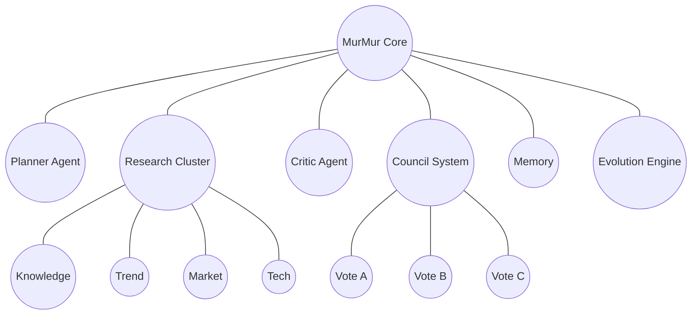

# 🜂 MurMur# MurMur : A Learning Constellation 🌌
A modular multi-agent reasoning architecture where specialized AI agents collaborate to plan, research, critique, and evolve solutions.
## MurMur Constellation Architecture


### A Learning Constellation

Distributed Multi-Agent Intelligence System

<p align="center">


</p>

---

## ✦ Vision

MurMur explores a new paradigm for artificial intelligence.

Instead of relying on a single AI model, MurMur coordinates a **constellation of specialized agents** that collaborate, debate, and synthesize knowledge together.

The goal is to create a **distributed intelligence layer** capable of:

- large-scale research  
- narrative analysis  
- creative systems  
- decision support  

MurMur acts as an orchestration layer connecting AI agents, infrastructure, and knowledge systems.

---

## ✦ MurMur Constellation Architecture

MurMur operates as a **constellation of agents coordinated by an orchestrator**.

Tasks move through a structured pipeline where agents analyze, debate, and synthesize results.

```mermaid
flowchart TB
    U[Human / Founder] --> UI[MurMur Dashboard]

    UI --> ORCH[God Agent / Orchestrator]

    ORCH --> COUNCIL[Constellation Council]

    COUNCIL --> A1[Research Agent]
    COUNCIL --> A2[Pattern Detection Agent]
    COUNCIL --> A3[Narrative Analysis Agent]
    COUNCIL --> A4[Strategy Agent]
    COUNCIL --> A5[Experimental Agent]
    COUNCIL --> A6[Teacher Agent]
    COUNCIL --> A7[Reflective Agent]

    A1 --> QUEUE[Supabase Job Queue]
    A2 --> QUEUE
    A3 --> QUEUE
    A4 --> QUEUE
    A5 --> QUEUE
    A6 --> QUEUE
    A7 --> QUEUE

    QUEUE --> WORKERS[Workers / Executors]

    WORKERS --> MEMORY[Knowledge Store]
    WORKERS --> OUTPUT[Results]

    MEMORY --> ORCH
    OUTPUT --> UI
